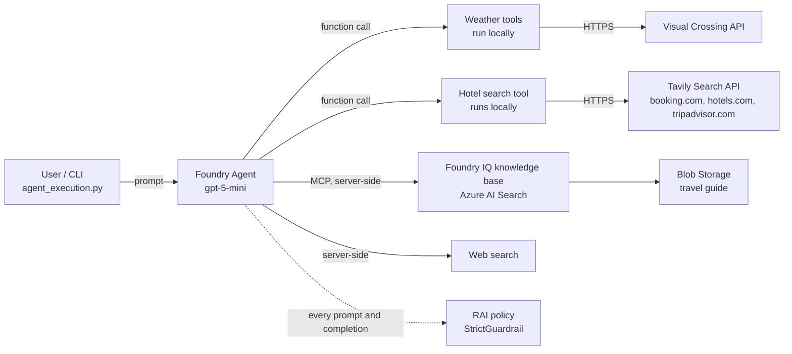

# Travel Agent Planner

An AI agent that helps you plan a trip to a chosen destination anywhere in the world. The agent runs server-side in **Azure AI Foundry Agent Service**. It uses **Foundry IQ** as a RAG knowledge base: a travel guide covering 182 cities in Europe, Asia and the Americas, indexed with Azure AI Search. It also calls helper functions that fetch **weather data** from the Visual Crossing API and **search for hotels** on booking sites through the Tavily Search API. Web search is a fallback for anything the knowledge base does not cover, such as visa requirements or current events.

A typical answer includes a weather summary for the travel dates, a day-by-day plan with citations to the travel guide, hotel suggestions with prices and booking links (when the user asks about accommodation), transport and practical tips, and packing advice based on the forecast.



## Table of contents

1. [Repository layout](#repository-layout)
2. [Local setup](#local-setup)
3. [Infrastructure: `resource_deployment.bicep`](#infrastructure-resource_deploymentbicep)
4. [The agent](#the-agent)
5. [Tools](#tools)
6. [Guardrail configuration: `StrictGuardrail`](#guardrail-configuration-strictguardrail)
7. [Clean-up](#clean-up)

---

## Repository layout

| Path | Purpose |
|---|---|
| `resource_deployment.bicep` | Azure infrastructure: Foundry resource and project, model deployments, AI Search, Storage, knowledge base connection and role assignments |
| `rag_setup.py` | Uploads the travel guide and builds the Foundry IQ knowledge source and knowledge base |
| `agent_deployment.py` | Creates or updates the RAI policy and the server-side agent (system prompt and tools) |
| `agent_execution.py` | Interactive command-line chat with the deployed agent; runs the weather and hotel search tools locally |
| `config.yaml` | Agent name, system prompt and guardrail (RAI) settings |
| `classes/foundry_iq_services.py` | `FoundryIQService`: blob upload, knowledge source, ingestion, knowledge base, MCP tool |
| `classes/weather_services.py` | `WeatherService` and the `get_forecast_weather` / `get_current_weather` tools |
| `classes/hotel_services.py` | `HotelService` (Tavily client) and the `search_for_hotels` tool |
| `classes/rai_policies_services.py` | `RaiPolicyManager`: builds and deploys the RAI policy from `config.yaml` |
| `utils/utils.py` | Helpers for normalising weather API responses |
| `inputs/` | Source documents for the knowledge base (`world_city_travel_guide.md`, `.pdf`) |
| `scripts/` | Step-by-step CLI commands for environment setup, deployment and deletion |

---

## Local setup

### Prerequisites

- Python 3.10 or later (developed with Python 3.13)
- [Azure CLI](https://aka.ms/installazurecli) with Bicep
- An Azure subscription where you can create resource groups and role assignments (for example, Owner)
- A [Visual Crossing](https://www.visualcrossing.com/weather-api) API key for weather data
- A [Tavily](https://tavily.com) API key for hotel search

> The commands in `scripts/*.sh` use PowerShell line continuation (`` ` ``). Run them in PowerShell, or replace the backticks with `\` in bash.

### 1. Python environment

```powershell
python -m venv tutorials
tutorials\Scripts\activate
pip install -r requirements.txt
```

### 2. Azure CLI login and Bicep

```powershell
az login
az bicep install
az bicep upgrade
```

### 3. Deploy the Azure resources

Choose a unique prefix. Resource names, including the globally unique storage account name, are derived from it.

```powershell
az group create --name <resource-group> --location swedencentral

az deployment group create `
  --resource-group <resource-group> `
  --template-file resource_deployment.bicep `
  --parameters projectPrefix="<prefix>" `
    userPrincipalId="$(az ad signed-in-user show --query id -o tsv)"

# Endpoints and resource names for the environment variables
az deployment group show `
  --resource-group <resource-group> `
  --name resource_deployment `
  --query properties.outputs
```

### 4. Retrieve the keys used by Azure AI Search

The Bicep template never outputs keys. Get them with the CLI and put them **only** in your local `.env` file:

```powershell
# STORAGE_CONNECTION_STRING: the Search indexer reads the blob container
az storage account show-connection-string `
  --resource-group <resource-group> 
  --name <storage-account-name> `
  --query connectionString -o tsv

# AOAI_API_KEY: Search calls the embedding and chat models
az cognitiveservices account keys list `
  --resource-group <resource-group> 
  --name <foundry-resource-name> `
  --query key1 -o tsv
```

### 5. Configure environment variables

Create a `.env` file in the repository root. It is listed in `.gitignore`, so **never commit it**. The scripts read settings from environment variables and do not load `.env` themselves. Load the file into the environment, for example with `envFile` in a VS Code `launch.json` (also git-ignored) or by exporting the variables in your shell.

```dotenv
# --- Azure / Foundry (from the Bicep outputs) ---
PROJECT_ENDPOINT=https://<foundry-resource>.services.ai.azure.com/api/projects/<project>
AOAI_ENDPOINT=https://<foundry-resource>.openai.azure.com
LLM_MODEL_DEPLOYMENT_NAME=<prefix>-llm-deploy
EMBEDDING_MODEL_DEPLOYMENT_NAME=<prefix>-embedding-deploy
SEARCH_ENDPOINT=https://<prefix>-aisearch.search.windows.net
STORAGE_ACCOUNT_URL=https://<storage-account>.blob.core.windows.net/
BLOB_CONTAINER_NAME=travel-guide
KNOWLEDGE_BASE_NAME=travel-guide-kb
KNOWLEDGE_BASE_CONNECTION_NAME=travel-guide-kb-mcp
KNOWLEDGE_SOURCE_NAME=travel-guide-ks
SOURCE_FILE_PATH=inputs/world_city_travel_guide.md

# --- RAI policy deployment (management plane) ---
AZURE_SUBSCRIPTION_ID=<subscription-id>
AZURE_RESOURCE_GROUP=<resource-group>
AZURE_COGNITIVE_ACCOUNT_NAME=<foundry-resource-name>

# --- Agent runtime (must match agent_name in config.yaml) ---
AGENT_NAME=travelAgent

# --- Secrets (never commit) ---
STORAGE_CONNECTION_STRING=<from step 4>
AOAI_API_KEY=<from step 4>
VISUAL_CROSSING_API_KEY=<your Visual Crossing key>
TAVILY_API_KEY=<your Tavily key>
```

### 6. Build the knowledge base

```powershell
python rag_setup.py
```

This uploads the travel guide to Blob Storage, creates the knowledge source (Azure AI Search then generates the data source, skillset, index and indexer), waits for ingestion to finish (up to 15 minutes), and creates the knowledge base.

### 7. Deploy the agent

```powershell
python agent_deployment.py
```

This creates or updates the `StrictGuardrail` RAI policy, then creates a new version of the `travelAgent` agent with the system prompt, tools and policy attached.

### 8. Chat with the agent

```powershell
python agent_execution.py
```

Type your questions at the `You:` prompt. Type `exit` or `quit`, or press `Ctrl+C`, to end the session. Every tool call is logged as `[TOOL] -> ...` / `[TOOL] <- ...`.

Example prompt:

```text
I'm going to Lisbon from 2026-10-12 to 2026-10-15 on a medium budget. I like food and museums. Can you plan my trip?
```

Example prompt with hotel search:

```text
I'm going to Lisbon from 2026-10-12 to 2026-10-15. Can you suggest a few hotels near the city centre?
```

---

## Infrastructure: `resource_deployment.bicep`

The template is based on the [Foundry basic setup sample](https://github.com/microsoft-foundry/foundry-samples/blob/main/infrastructure/infrastructure-setup-bicep/00-basic/main.bicep) and extended with the RAG components. It deploys to the resource group's location.

### Parameters

| Parameter | Default | Description |
|---|---|---|
| `projectPrefix` | *(required)* | Base name for all resources |
| `userPrincipalId` | *(required)* | Object ID of the user who runs `rag_setup.py` (`az ad signed-in-user show --query id -o tsv`) |
| `aiFoundryName` | `projectPrefix` | Foundry (AIServices) account name and custom subdomain |
| `aiProjectName` | `<aiFoundryName>-proj` | Foundry project name |
| `llmModelDeploymentName` | `<prefix>-llm-deploy` | Chat model deployment |
| `embeddingModelDeploymentName` | `<prefix>-embedding-deploy` | Embedding model deployment |
| `aiSearchName` | `<prefix>-aisearch` | Azure AI Search service |
| `storageName` | `<prefix>st` (lowercase, no hyphens, max 24 chars) | Storage account |
| `blobContainerName` | `travel-guide` | Container with the source documents |
| `knowledgeBaseName` | `travel-guide-kb` | Must match the knowledge base created by `rag_setup.py` |
| `knowledgeBaseConnectionName` | `<knowledgeBaseName>-mcp` | Project connection used by the agent's MCP tool |
| `location` | resource group location | Azure region for all resources |

### Resources

| Resource | Details |
|---|---|
| **Azure AI Foundry account** (`Microsoft.CognitiveServices/accounts`, kind `AIServices`, SKU `S0`) | System-assigned identity, project management enabled, custom subdomain. Local (key) auth stays enabled because Azure AI Search calls the models with an API key. |
| **Foundry project** | Logical container for the agent, connections and deployments. |
| **LLM deployment**: `gpt-5-mini` (2025-08-07) | `GlobalStandard`, 50K TPM. Used by the agent, and by AI Search for ingestion and query planning. |
| **Embedding deployment**: `text-embedding-3-small` | `GlobalStandard`, 50K TPM (1536 dimensions). Used to vectorise the travel guide. Deployed after the LLM to avoid parallel deployment conflicts. |
| **Azure AI Search** | `free` SKU, semantic ranker `free` (required by agentic retrieval). Accepts both Entra ID (for the user) and API keys (for services). |
| **Storage account + blob container** | `StorageV2`, `Standard_LRS`, TLS 1.2, no public blob access. Shared-key access is enabled because the Search indexer reads the container with the account key. |
| **Knowledge base connection** (`RemoteTool`, `CustomKeys`) | Project connection pointing at the knowledge base MCP endpoint (`.../knowledgebases/<kb>/mcp`). It stores the read-only Search **query key**, which is read from the search service at deployment time, so the key never appears in code or outputs. It can be created before the knowledge base exists. |

### Authentication model

The project uses a hybrid approach:

- **User → Azure (Entra ID).** `rag_setup.py` and `agent_deployment.py` use `DefaultAzureCredential` (`az login`). The template assigns the user these roles:
  - `Storage Blob Data Contributor` on the storage account (upload documents)
  - `Search Service Contributor` on the search service (create knowledge sources and knowledge bases)
  - `Search Index Data Contributor` on the search service (read index content and status)
- **Service → service (keys).** AI Search reads Storage with the account connection string and calls the models with the Foundry API key. The agent queries the knowledge base with the Search query key stored in the project connection.

Role assignments for a fully managed-identity setup (Search → Storage, Search → Foundry, project → Search) are included in the template but commented out. The free Search tier does not support managed identities.

### Outputs

`projectEndpoint`, `aoaiEndpoint`, `llmModelDeploymentName`, `embeddingModelDeploymentName`, `searchEndpoint`, `storageAccountUrl`, `storageAccountName`, `aiFoundryName`, `blobContainerName`, `knowledgeBaseName`, `knowledgeBaseConnectionName`. These feed the environment variables above. Keys are never output.

---

## The agent

The agent, `travelAgent`, is a **prompt agent** (`PromptAgentDefinition`) hosted in Azure AI Foundry Agent Service. It uses the `gpt-5-mini` deployment.

### Deployment (`agent_deployment.py`)

1. Reads `config.yaml` (agent name, system prompt, guardrails).
2. Creates or updates the RAI policy through `RaiPolicyManager` and gets a `RaiConfig` back.
3. Defines the five tools (see [Tools](#tools)).
4. Calls `project_client.agents.create_version(...)`, which creates a new agent version with the instructions, tools and RAI config.

### Execution (`agent_execution.py`)

The client uses the Microsoft Agent Framework (`agent_framework.foundry.FoundryAgent`). It connects to the existing server-side agent by name and passes in the local Python implementations of the weather and hotel search tools. When the server-side agent requests a function call, `FoundryAgent` runs the local function and sends the result back. The MCP knowledge base and web search tools run entirely server-side.

- Conversations persist across turns (`agent.create_conversation()`), so the agent remembers earlier messages.
- The `log_tool_calls` middleware prints every function call and a truncated result.
- If a turn fails, the client starts a new conversation. The server-side thread could otherwise be left with a function call that has no output, and it could not continue.

### Behaviour (system prompt in `config.yaml`)

The system prompt sets the following rules:

- **Accuracy first.** Never invent facts, places, prices, opening hours or citations. If no source has the answer, reply exactly: *"I'm sorry, I don't have that information."*
- **Knowledge base first.** Always call `knowledge_base_retrieve` for cities, attractions, restaurants, events, transport and practical tips. Use only passages about the requested destination.
- **Web search as a fallback** for gaps such as visa requirements and current events. Label clearly which facts come from the knowledge base and which from web search.
- **Weather is mandatory** whenever a destination is mentioned. Report max/min temperature, precipitation probability, wind speed and conditions for each day, and base packing tips on the actual data.
- **Hotels only from `search_for_hotels`.** When the user asks about accommodation, the agent always calls `search_for_hotels` and never uses web search for hotels. It recommends 3–5 hotels, preferring single-hotel pages, with name, price per night, rating, highlights and the exact booking link from the results. Prices are shown only in the currency returned by the tool (PLN or USD), never converted. A missing price is reported as *"price not available"*.
- **Citations.** Every knowledge base fact carries the exact source marker returned by the tool. The agent never creates citation markers itself.
- **Answer structure.** Weather summary, then the (day-by-day) plan, then accommodation (only when hotels were searched), then transport and practical tips, then an optional follow-up offer. Maximum 500 words.

The prompt ends with good and bad examples for citations, missing information, weather reporting, mixed sources and hotel reporting.

---

## Tools

| Tool | Type | Where it runs | Purpose |
|---|---|---|---|
| `knowledge_base_retrieve` | MCP (Foundry IQ) | Server-side | RAG retrieval from the travel guide |
| `web_search` | Built-in `WebSearchTool` | Server-side | Fallback for information missing from the knowledge base |
| `get_forecast_weather` | `FunctionTool` | Locally, in `agent_execution.py` | Daily forecast for a location and date range |
| `get_current_weather` | `FunctionTool` | Locally, in `agent_execution.py` | Current weather conditions |
| `search_for_hotels` | `FunctionTool` | Locally, in `agent_execution.py` | Hotel search on booking sites via Tavily |

### Foundry IQ knowledge base (`knowledge_base_retrieve`)

`FoundryIQService` (`classes/foundry_iq_services.py`) builds the knowledge base in five steps:

1. `upload_blob()` uploads the source file (`inputs/world_city_travel_guide.md`) to the blob container with the correct content type.
2. `create_blob_knowledge_source()` creates an Azure Blob knowledge source. Azure AI Search then generates `<name>-datasource`, `-skillset`, `-index` and `-indexer` automatically. Ingestion uses `gpt-5-mini` and `text-embedding-3-small` in `MINIMAL` content extraction mode.
3. `wait_for_ingestion()` polls the knowledge source status every 15 s, for up to 900 s. It fails if any document could not be indexed.
4. `create_knowledge_base()` creates the knowledge base with `EXTRACTIVE_DATA` output mode (it returns raw chunks and the agent writes the answer) and automatic retrieval reasoning effort.
5. `create_mcp_tool()` returns an `MCPTool` pointing at the knowledge base MCP endpoint (API version `2026-08-01-preview`). It is restricted to `knowledge_base_retrieve`, with `require_approval="never"` because the tool is read-only, and it authenticates through the `RemoteTool` project connection from the Bicep template.

`rag_setup.py` runs steps 1–4. Step 5 runs in `agent_deployment.py`.

### Web search

A `WebSearchTool` with a medium search context size, an approximate user location (Warsaw, PL) and `external_web_access=False`. The system prompt allows it only when the knowledge base has no answer.

### Weather tools (`classes/weather_services.py`)

Both tools call the [Visual Crossing Timeline API](https://www.visualcrossing.com/resources/documentation/weather-api/timeline-weather-api/) with metric units, a 10 s timeout and the `VISUAL_CROSSING_API_KEY` environment variable.

- **`get_forecast_weather(location, start_date=None, end_date=None)`** returns daily data only (no hourly data, to keep the tool output small): date, max/min/feels-like temperature, precipitation, precipitation probability and type, wind speed, conditions, description, sunrise and sunset. Without dates it returns the next 15 days. Dates use `YYYY-MM-DD` format.
- **`get_current_weather(location)`** returns the current conditions.

Sunrise and sunset times are shortened to `HH:MM` (`utils/utils.py`). Errors never raise exceptions. They come back as `{"error": "..."}`, for example for an unknown city, an invalid date, a timeout or a missing API key, so the agent can react to them in its answer.

### Hotel search tool (`classes/hotel_services.py`)

Hotel search uses the [Tavily Search API](https://docs.tavily.com) (`tavily-python`) with the `TAVILY_API_KEY` environment variable. `HotelService` creates a `TavilyClient` in its constructor, and its `search_hotels()` method runs the search. The `search_for_hotels` tool is a thin wrapper that reads the API key, creates the service and returns its result.

**`search_for_hotels(city, check_in=None, check_out=None, language="en")`**

| Parameter | Required | Description |
|---|---|---|
| `city` | Yes | City to search for hotels in |
| `check_in` | No | Check-in date, `YYYY-MM-DD` |
| `check_out` | No | Check-out date, `YYYY-MM-DD`. Use only with `check_in` |
| `language` | No | ISO 639-1 code of the conversation language. `pl` returns prices in PLN, any other value in USD |

How it works:

1. **Target currency.** `language` decides the single currency used for the whole search: `pl` → PLN, anything else → USD.
2. **Query.** The query is built in the matching language, for example `hotele Kraków check-in 2026-10-10 check-out 2026-10-12 cena za noc w złotówkach opinie rezerwacja` for PLN, or `hotels in Lisbon ... price per night USD rating reviews booking` for USD.
3. **Search.** Tavily runs an `advanced` search limited to `booking.com`, `hotels.com` and `tripadvisor.com`, with up to 8 results and a country filter matching the currency (Poland or United States).
4. **Post-processing.**
   - booking.com links get `selected_currency` and `lang` query parameters, so the booking page shows the same currency as the search results.
   - Each result is marked `is_direct: true` when its URL points at a single hotel's page (`/hotel/...`, excluding `/reviews/` pages). Direct pages are sorted first, because they are more useful than city or category overview pages.

Example result:

```json
{
  "city": "Kraków",
  "check_in": "2026-10-10",
  "check_out": "2026-10-12",
  "target_currency": "PLN",
  "results": [
    {
      "url": "https://www.booking.com/hotel/pl/...html?selected_currency=PLN&lang=pl",
      "title": "...",
      "content": "...",
      "score": 0.87,
      "is_direct": true
    }
  ]
}
```

The tool returns raw page snippets (`title`, `content`), not structured hotel data. The agent extracts the hotel name, price, rating and highlights from them, following the hotel reporting rules in the system prompt. As with the weather tools, errors never raise exceptions. A missing city, a missing API key, no results or a failed Tavily call come back as `{"error": "..."}`.

### Keeping tool schemas in sync

The function tool schemas are defined twice. `agent_deployment.py` holds the `FunctionTool` JSON schemas for the server-side agent, and `weather_services.py` / `hotel_services.py` hold the `@tool` Python implementations for the client. **Keep the tool and parameter names in sync.**

---

## Guardrail configuration: `StrictGuardrail`

Content safety is enforced by a custom **RAI (Responsible AI) policy** attached to the agent. The policy is defined in the `guardrails` section of `config.yaml`, and `RaiPolicyManager` (`classes/rai_policies_services.py`) deploys it with the Azure management SDK (`azure-mgmt-cognitiveservices`) to the Foundry account.

```yaml
guardrails:
  rai_policy_name: "StrictGuardrail"
  controls:
    jailbreak:                  { enabled: true, action: "Block" }
    indirect_prompt_injections: { enabled: true, action: "Block" }
    content_harms:
      enabled: true
      hate: "Low"
      sexual: "Low"
      self_harm: "Low"
      violence: "Low"
      action: "Block"
    profanity:                  { enabled: true, action: "Block" }
    protected_materials:        { code: true, text: true, action: "Block" }
```

### Policy properties

- **Base policy:** `Microsoft.Default`
- **Mode:** `Blocking`. Filtered content is blocked, not only annotated.

### Filters

| Control | Filter name(s) in the policy | Applied to |
|---|---|---|
| Jailbreak | `Jailbreak` | Prompt |
| Indirect prompt injection | `Indirect Attack` | Prompt |
| Hate | `Hate` | Prompt and completion |
| Sexual | `Sexual` | Prompt and completion |
| Self-harm | `Selfharm` | Prompt and completion |
| Violence | `Violence` | Prompt and completion |
| Profanity | `Profanity` | Prompt and completion |
| Protected material (text) | `Protected Material Text` | Prompt and completion |
| Protected material (code) | `Protected Material Code` | Prompt and completion |

For each control, `enabled` switches the filter on or off, and `action: "Block"` sets `blocking=true`.

### Severity levels for content harms

The `hate`, `sexual`, `self_harm` and `violence` values in `config.yaml` are translated into the policy's `severityThreshold` as follows:

| `config.yaml` value | `severityThreshold` sent to Azure |
|---|---|
| `Low` | `High` |
| `Medium` | `Medium` |
| `High` | `Low` |

### Changing the guardrail

Edit `config.yaml` and run `python agent_deployment.py` again. The policy is created or updated under the same name and attached to a new agent version.

---

## Clean-up

To stop incurring costs, delete the resource group. Then purge the soft-deleted Foundry account so the name can be reused:

```powershell
az group delete --name <resource-group> --yes

az cognitiveservices account purge `
  --location <location> `
  --resource-group <resource-group> `
  --name <foundry-resource-name>
```

To list failed deployment operations when troubleshooting a deployment:

```powershell
az deployment operation group list `
  --resource-group <resource-group> --name resource_deployment `
  --query "[?properties.provisioningState=='Failed'].{resource:properties.targetResource.resourceName, error:properties.statusMessage.error.code}" `
  -o table
```
