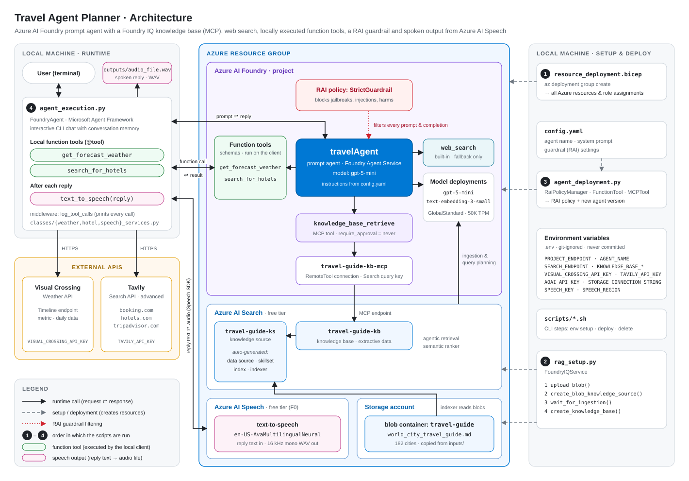

# Travel Agent Planner

> **This is the multi-agent version.** The `main` branch runs a team of five agents coordinated with the **Magentic orchestration** from Microsoft Agent Framework. The another version with a single agent is on the [`single-agent`](https://github.com/Po33ski/Travel-Agent-Planner/tree/single-agent) branch.

An AI assistant that helps you plan a trip to a chosen destination anywhere in the world. A **manager agent** plans the work and delegates it to four **specialist agents**, all hosted server-side in **Azure AI Foundry Agent Service**:

- a knowledge base agent that uses **Foundry IQ** as a RAG knowledge base: a travel guide covering 182 cities in Europe, Asia and the Americas, indexed with Azure AI Search
- a web search agent, used as a fallback for anything the knowledge base does not cover, such as visa requirements or current events
- a weather agent that fetches **weather data** from the Visual Crossing API
- a hotel agent that **searches for hotels** on booking sites through the Tavily Search API

The team uses **two LLMs**: `gpt-5.6-luna` for the manager, which does the planning and writes the final answer, and `gpt-5-mini` for the four specialist agents.

A typical answer includes a weather summary for the travel dates, a day-by-day plan with citations to the travel guide, hotel suggestions with prices and booking links (when the user asks about accommodation), and transport and practical tips. The final answer is also read out with **Azure AI Speech** and saved as an audio file.

Every user signs in with a name. Their profile, preferences and conversation history (in a chat fine-tuning format) are kept in **Azure Cosmos DB**, and **Azure AI Language** detects the language of each question and stores it as a preference. All endpoints, resource names and keys live in **Azure Key Vault**, so the only setting a script needs is the Key Vault URL.



## Table of contents

1. [Repository layout](#repository-layout)
2. [Local setup](#local-setup)
3. [Infrastructure: `resource_deployment.bicep`](#infrastructure-resource_deploymentbicep)
4. [The agents](#the-agents)
5. [Tools](#tools)
6. [User memory and language detection](#user-memory-and-language-detection)
7. [Guardrail configuration: `StrictGuardrail`](#guardrail-configuration-strictguardrail)
8. [Clean-up](#clean-up)

---

## Repository layout

| Path | Purpose |
|---|---|
| `resource_deployment.bicep` | Azure infrastructure: Foundry resource and project, model deployments, AI Search, Storage, Speech, Language, Cosmos DB, Key Vault with all settings and keys, knowledge base connection and role assignments |
| `rag_setup.py` | Uploads the travel guide and builds the Foundry IQ knowledge source and knowledge base |
| `agents/<agent>_deployment.py` | One script per agent. Creates or updates the RAI policy and the server-side agent (system prompt and tools) |
| `agents/<agent>_config.yaml` | One file per agent: agent name and system prompt |
| `agent_execution.py` | Interactive command-line chat. Asks for the user name, builds the Magentic workflow, runs the weather and hotel search tools locally, saves the conversation and preferences to Cosmos DB and converts the final answer to speech |
| `config.yaml` | Guardrail (RAI) settings shared by all agents, profile TTL for Cosmos DB and the NLP sentiment threshold |
| `classes/secret_manager_services.py` | `SecretManager`: reads secrets from Key Vault and caches them in memory |
| `classes/cosmos_memory_services.py` | `CosmosMemory`: user profiles, preferences and conversation history in Cosmos DB |
| `classes/azure_nlp_services.py` | `AzureNLPService`: language detection and other Azure AI Language features |
| `classes/foundry_iq_services.py` | `FoundryIQService`: blob upload, knowledge source, ingestion, knowledge base, MCP tool |
| `classes/weather_services.py` | `WeatherService` and the `get_forecast_weather` / `get_current_weather` tools |
| `classes/hotel_services.py` | `HotelService` (Tavily client) and the `search_for_hotels` tool |
| `classes/speech_services.py` | `AzureSpeechService` and the `text_to_speech` helper |
| `classes/rai_policies_services.py` | `RaiPolicyManager`: builds and deploys the RAI policy from `config.yaml` |
| `utils/utils.py` | Helpers for normalising weather API responses |
| `inputs/` | Source documents for the knowledge base (`world_city_travel_guide.md`, `.pdf`) |
| `outputs/` | Audio file with the spoken final answer |
| `scripts/` | Step-by-step CLI commands for environment setup, deployment and deletion |
| `docs/architecture.svg` | Architecture diagram shown at the top of this README |

---

## Local setup

### Prerequisites

- Python 3.10 or later (developed with Python 3.13)
- [Azure CLI](https://aka.ms/installazurecli) with Bicep
- An Azure subscription where you can create resource groups and role assignments (for example, Owner)
- A [Visual Crossing](https://www.visualcrossing.com/weather-api) API key for weather data
- A [Tavily](https://tavily.com) API key for hotel search

The template uses free tiers, and Azure allows **one of each per subscription**: a free (F0) Speech resource, a free (F0) Language resource, a free Azure AI Search service and a Cosmos DB account with the free tier. If one of them already exists, or a Speech or Language resource is still soft-deleted, the deployment fails (for example with `CanNotCreateMultipleFreeAccounts`). See [Clean-up](#clean-up) for how to purge soft-deleted resources.

> The commands in `scripts/*.sh` use PowerShell line continuation (`` ` ``). Run them in PowerShell, or replace the backticks with `\` in bash.

### 1. Python environment

```powershell
python -m venv tutorials
tutorials\Scripts\activate
pip install -r requirements.txt
```

### 2. Azure CLI login and Bicep

```powershell
az login
az bicep install
az bicep upgrade
```

### 3. Add the third-party API keys to `.env`

Create a `.env` file in the repository root. It is listed in `.gitignore`, so **never commit it**. It holds only the two keys that do not come from Azure:

```dotenv
VISUAL_CROSSING_API_KEY="<your Visual Crossing key>"
TAVILY_API_KEY="<your Tavily key>"
```

The deployment passes them to the template as `@secure()` parameters, and the template stores them in Key Vault. The Python code never reads `.env`.

### 4. Deploy the Azure resources

Choose a unique prefix. Resource names, including the globally unique storage account, Key Vault and Cosmos DB names, are derived from it. All resources are created in the resource group's region (see [Region](#region)).

```powershell
az group create --name <resource-group> --location switzerlandnorth

# Load .env into this PowerShell session (Bicep cannot read the file itself)
Get-Content .env | ForEach-Object {
  if ($_ -match '^\s*([A-Za-z_][A-Za-z0-9_]*)\s*=\s*(.*)$') {
    Set-Item "env:$($Matches[1])" $Matches[2].Trim().Trim('"', "'")
  }
}

az deployment group create `
  --resource-group <resource-group> `
  --template-file resource_deployment.bicep `
  --parameters projectPrefix="<prefix>" `
    userPrincipalId="$(az ad signed-in-user show --query id -o tsv)" `
    visualCrossingApiKey="$env:VISUAL_CROSSING_API_KEY" `
    tavilyApiKey="$env:TAVILY_API_KEY"

# The only output is KEY_VAULT_URL
az deployment group show `
  --resource-group <resource-group> `
  --name resource_deployment `
  --query properties.outputs
```

Good to know:

- **Preview before deploying.** Add `--confirm-with-what-if` to `az deployment group create` to see what will be created or changed and confirm with `y/n`. Secrets that hold keys always show as *Modify*, because what-if cannot evaluate `listKeys()` or secure parameters. Their values don't actually change.
- **Running the deployment again is safe.** The default mode is incremental: resources that already exist with the same settings are left unchanged, and only missing ones are created. Properties changed by hand in the portal are reset to the values in the template.
- **`InsufficientResourcesAvailable`** means the region has no capacity left for a new service of that type (most often the free Azure AI Search tier). Choose another region (see [Region](#region)).

### 5. Configure the local settings

Every script reads its endpoints, names and keys from Key Vault when it starts. It only needs the following environment variables:

| Variable | Used by | Required | Description |
|---|---|---|---|
| `KEY_VAULT_URL` | all scripts | yes | `KEY_VAULT_URL` output of the deployment, for example `https://<prefix>-kv.vault.azure.net/` |
| `SOURCE_FILE_PATH` | `rag_setup.py` | yes | `inputs/world_city_travel_guide.md` |
| `KNOWLEDGE_SOURCE_NAME` | `rag_setup.py` | no | Default `travel-guide-ks` |
| `USER_ROLE` | `agent_execution.py` | no | Stored in the profile of a new user, for example `Traveler` |

None of them is secret. In VS Code, set them in the `env` section of each configuration in `.vscode/launch.json` (git-ignored), for example:

```jsonc
{
  "name": "Python Debugger: Agent Execution",
  "type": "debugpy",
  "request": "launch",
  "program": "${workspaceFolder}/agent_execution.py",
  "env": {
    "KEY_VAULT_URL": "https://<prefix>-kv.vault.azure.net/",
    "USER_ROLE": "Traveler"
  }
}
```

The template gives your account the `Key Vault Secrets User` role. Role assignments can take a few minutes to take effect, so a `403 Forbidden` from Key Vault right after the deployment usually disappears on its own.

### 6. Build the knowledge base

```powershell
python rag_setup.py
```

This uploads the travel guide to Blob Storage, creates the knowledge source (Azure AI Search then generates the data source, skillset, index and indexer), waits for ingestion to finish (up to 15 minutes), and creates the knowledge base.

### 7. Deploy the agents

Run all five scripts. The order does not matter.

```powershell
python agents/manager_agent_deployment.py
python agents/rag_data_agent_deployment.py
python agents/web_data_agent_deployment.py
python agents/weather_agent_deployment.py
python agents/hotel_agent_deployment.py
```

Each script creates or updates the `StrictGuardrail` RAI policy, then creates a new version of its agent with the system prompt, tools and policy attached.

> Run the scripts by path, as shown. `python -m agents.<script>` does not work when the `openai-agents` package is installed, because that package is also imported as `agents`.

### 8. Chat with the agents

```powershell
python agent_execution.py
```

The chat first asks for your **user name** and does not start the agents until you give one. A known name loads your existing profile, and a new name creates one (see [User memory and language detection](#user-memory-and-language-detection)).

Type your questions at the `You:` prompt. Type `exit` or `quit`, or press `Ctrl+C`, to end the session. Every local tool call is logged as `[TOOL] -> ...` / `[TOOL] <- ...`.

Each message is handled as a separate task and **the team does not remember earlier messages**, so put everything the team needs (destination, dates, budget, interests) in one message. An answer takes longer than with a single agent, because the manager and the specialists make several model calls per message.

Example prompt:

```text
I'm going to Lisbon from 2026-10-12 to 2026-10-15 on a medium budget. I like food and museums. Can you plan my trip?
```

Example prompt with hotel search:

```text
I'm going to Lisbon from 2026-10-12 to 2026-10-15. Can you plan my trip and suggest a few hotels near the city centre?
```

---

## Infrastructure: `resource_deployment.bicep`

The template is based on the [Foundry basic setup sample](https://github.com/microsoft-foundry/foundry-samples/blob/main/infrastructure/infrastructure-setup-bicep/00-basic/main.bicep) and extended with the RAG components, Speech, Language, Cosmos DB and Key Vault. It deploys to the resource group's location.

### Region

The scripts use **Switzerland North**, the region closest to Poland that supports every service in this project. Regions that were checked against the Microsoft Learn region tables:

| Region | Why it is not used |
|---|---|
| Poland Central | No Azure AI Speech |
| Sweden Central, Germany West Central, West Europe, North Europe | Marked *high demand* for Azure AI Search: new search services can't be created |
| Italy North, Norway East | No semantic ranker / agentic retrieval on the free Search tier |

France Central and UK South support everything too. Regional capacity changes over time, so check the [Azure AI Search region list](https://learn.microsoft.com/azure/search/search-region-support) if a deployment fails with `InsufficientResourcesAvailable`.

To use another region, change `--location` in `az group create`. Existing resources can't be moved to another region: delete the resource group, purge the soft-deleted resources (see [Clean-up](#clean-up)) and deploy again.

### Parameters

| Parameter | Default | Description |
|---|---|---|
| `projectPrefix` | *(required)* | Base name for all resources |
| `userPrincipalId` | *(required)* | Object ID of the user who runs the scripts (`az ad signed-in-user show --query id -o tsv`) |
| `visualCrossingApiKey` | *(required, secure)* | Visual Crossing API key, stored in Key Vault |
| `tavilyApiKey` | *(required, secure)* | Tavily API key, stored in Key Vault |
| `aiFoundryName` | `projectPrefix` | Foundry (AIServices) account name and custom subdomain |
| `aiProjectName` | `<aiFoundryName>-proj` | Foundry project name |
| `llmModelDeploymentName` | `<prefix>-llm-deploy` | `gpt-5.6-luna` deployment, used by the manager agent |
| `llmMiniModelDeploymentName` | `<prefix>-llm-mini-deploy` | `gpt-5-mini` deployment, used by the specialist agents and the knowledge base |
| `embeddingModelDeploymentName` | `<prefix>-embedding-deploy` | Embedding model deployment |
| `aiSearchName` | `<prefix>-aisearch` | Azure AI Search service |
| `storageName` | `<prefix>st` (lowercase, no hyphens, max 24 chars) | Storage account |
| `blobContainerName` | `travel-guide` | Container with the source documents |
| `knowledgeBaseName` | `travel-guide-kb` | Must match the knowledge base created by `rag_setup.py` |
| `knowledgeBaseConnectionName` | `<knowledgeBaseName>-mcp` | Project connection used by the knowledge base agent's MCP tool |
| `speechName` | `<prefix>-speech` | Speech resource name and custom subdomain |
| `languageName` | `<prefix>-language` | Language resource name and custom subdomain |
| `cosmosDbAccountName` | `<prefix>-cosmos` | Cosmos DB account |
| `databaseName` | `<prefix>-cosmosdb` | Cosmos DB database |
| `containerName` | `<prefix>-container` | Cosmos DB container with the user profiles |
| `keyVaultName` | first 21 characters of the prefix + `-kv` (max 24 chars) | Key Vault |
| `location` | resource group location | Azure region for all resources |

### Resources

| Resource | Details |
|---|---|
| **Azure AI Foundry account** (`Microsoft.CognitiveServices/accounts`, kind `AIServices`, SKU `S0`) | System-assigned identity, project management enabled, custom subdomain. Local (key) auth stays enabled because Azure AI Search calls the models with an API key. |
| **Foundry project** | Logical container for the agents, connections and deployments. |
| **LLM deployment**: `gpt-5.6-luna` (2026-07-09) | `GlobalStandard`, 100K TPM. Used by `managerAgent`. |
| **LLM deployment**: `gpt-5-mini` (2025-08-07) | `GlobalStandard`, 100K TPM. Used by the four specialist agents, and by AI Search for ingestion and query planning. Deployed after the first LLM to avoid parallel deployment conflicts. |
| **Embedding deployment**: `text-embedding-3-small` | `GlobalStandard`, 50K TPM (1536 dimensions). Used to vectorise the travel guide. Deployed after the LLMs. |
| **Azure AI Search** | `free` SKU, semantic ranker `free` (required by agentic retrieval). Accepts both Entra ID (for the user) and API keys (for services). |
| **Storage account + blob container** | `StorageV2`, `Standard_LRS`, TLS 1.2, no public blob access. Shared-key access is enabled because the Search indexer reads the container with the account key. |
| **Knowledge base connection** (`RemoteTool`, `CustomKeys`) | Project connection pointing at the knowledge base MCP endpoint (`.../knowledgebases/<kb>/mcp`). It stores the read-only Search **query key**, which is read from the search service at deployment time, so the key never appears in code or outputs. It can be created before the knowledge base exists. |
| **Azure AI Speech** (kind `SpeechServices`, SKU `F0`) | Free tier, custom subdomain, key auth. Converts the final answer to speech. |
| **Azure AI Language** (kind `TextAnalytics`, SKU `F0`) | Free tier, custom subdomain, key auth. Detects the language of the user's questions. |
| **Azure Cosmos DB** (NoSQL API) | Free tier, `Session` consistency, single region. The database has 1,000 RU/s of shared throughput (covered by the free tier). The container is partitioned by `/userId`, has a default TTL of 90 days and a composite index on `userId` and `last_updated`. |
| **Azure Key Vault** | `standard` SKU, Azure RBAC authorization, soft delete for 7 days. Purge protection is off so that the vault name can be reused after a clean-up; it is commented out in the template and should be enabled in production. Holds all settings and keys (see below). |

### Key Vault secrets

The template writes **25 secrets**. A secret name is the setting name with `-` instead of `_`, because Key Vault names can't contain underscores (for example `PROJECT_ENDPOINT` → `PROJECT-ENDPOINT`). Keys are read from the resources during the deployment (`listKeys()`), so they never appear in code, outputs or the deployment history.

| Group | Secrets | Read by |
|---|---|---|
| Foundry | `PROJECT-ENDPOINT` | agent deployment scripts, `agent_execution.py` |
| | `LLM-MODEL-DEPLOYMENT-NAME`, `LLM-MINI-MODEL-DEPLOYMENT-NAME` | agent deployment scripts (`rag_setup.py` also reads the mini model) |
| | `AOAI-ENDPOINT`, `EMBEDDING-MODEL-DEPLOYMENT-NAME` | `rag_setup.py` |
| RAI policy (management plane) | `AZURE-SUBSCRIPTION-ID`, `AZURE-RESOURCE-GROUP`, `AZURE-COGNITIVE-ACCOUNT-NAME` | agent deployment scripts |
| Knowledge base | `SEARCH-ENDPOINT`, `KNOWLEDGE-BASE-NAME` | `rag_setup.py`, `rag_data_agent_deployment.py` |
| | `KNOWLEDGE-BASE-CONNECTION-NAME` | `rag_data_agent_deployment.py` |
| | `STORAGE-ACCOUNT-URL`, `BLOB-CONTAINER-NAME` | `rag_setup.py` |
| Keys AI Search uses in the background | `AOAI-API-KEY`, `STORAGE-CONNECTION-STRING` | `rag_setup.py` (passed to the knowledge source) |
| Speech | `SPEECH-KEY`, `SPEECH-REGION` | `speech_services.py` |
| Language | `LANGUAGE-ENDPOINT`, `LANGUAGE-KEY` | `agent_execution.py` |
| Cosmos DB | `COSMOSDB-ENDPOINT`, `COSMOSDB-DATABASE-NAME`, `COSMOSDB-CONTAINER-NAME`, `COSMOSDB-PRIMARY-KEY` | `agent_execution.py` |
| Third-party APIs | `VISUAL-CROSSING-API-KEY`, `TAVILY-API-KEY` | `weather_services.py`, `hotel_services.py` |

Each script creates a `SecretClient` with `DefaultAzureCredential` and wraps it in `SecretManager`, which caches every secret in memory for the lifetime of the process.

### Authentication model

The project uses a hybrid approach:

- **User → Azure (Entra ID).** All scripts use `DefaultAzureCredential` (`az login`) for Key Vault, the Foundry project and agents, Blob Storage, Azure AI Search and the RAI policy. The template assigns the user these roles:
  - `Key Vault Secrets User` on the Key Vault (read the settings and keys)
  - `Storage Blob Data Contributor` on the storage account (upload documents)
  - `Search Service Contributor` on the search service (create knowledge sources and knowledge bases)
  - `Search Index Data Contributor` on the search service (read index content and status)
- **User → Azure (keys from Key Vault).** The local client calls Speech, Language and Cosmos DB with keys that it reads from Key Vault. The weather and hotel tools read the Visual Crossing and Tavily keys the same way.
- **Service → service (keys).** AI Search reads Storage with the account connection string and calls the models with the Foundry API key. The knowledge base agent queries the knowledge base with the Search query key stored in the project connection.

Even though most services are called with keys, Key Vault itself is always opened with Entra ID, so no secret is stored on disk except the two third-party keys in `.env`, which are only needed for the deployment.

Role assignments for a fully managed-identity setup (Search → Storage, Search → Foundry, project → Search) are included in the template but commented out. The free Search tier does not support managed identities.

### Outputs

The only output is `KEY_VAULT_URL`. It isn't a secret, and everything else is read from Key Vault.

---

## The agents

All five agents are **prompt agents** (`PromptAgentDefinition`) hosted in Azure AI Foundry Agent Service. Each specialist has exactly one tool.

| Agent | Model | Tool | Role |
|---|---|---|---|
| `managerAgent` | `gpt-5.6-luna` | none | Plans the task, picks the next agent, checks progress and writes the final answer |
| `ragDataAgent` | `gpt-5-mini` | `knowledge_base_retrieve` | Attractions, restaurants, events, transport and practical tips from the travel guide. First choice for destination information |
| `webDataAgent` | `gpt-5-mini` | `web_search` | Fallback for information the knowledge base did not return |
| `weatherAgent` | `gpt-5-mini` | `get_forecast_weather` | Daily weather forecast for the destination and dates |
| `hotelAgent` | `gpt-5-mini` | `search_for_hotels` | Hotel offers with prices, ratings and booking links |

### Deployment (`agents/<agent>_deployment.py`)

Each script does the same four things for its own agent:

1. Reads its settings from Key Vault, `config.yaml` (guardrails) and its own `<agent>_config.yaml` (agent name and system prompt).
2. Creates or updates the RAI policy through `RaiPolicyManager` and gets a `RaiConfig` back.
3. Defines the agent's tool (see [Tools](#tools)). The manager has none.
4. Calls `project_client.agents.create_version(...)`, which creates a new agent version with the instructions, tool and RAI config.

The manager script takes its model from the `LLM-MODEL-DEPLOYMENT-NAME` secret. The four specialist scripts take theirs from `LLM-MINI-MODEL-DEPLOYMENT-NAME`.

### Orchestration (`agent_execution.py`)

The orchestration runs **on the client**. The agents never call each other. The local Magentic workflow (`MagenticBuilder` from Microsoft Agent Framework) calls each server-side agent through a `FoundryAgent` client.

Before the first message, the chat asks for the user name and loads or creates the user's profile in Cosmos DB. For every user message the workflow then does the following:

1. **Plan.** The manager collects the known facts and writes a plan for the team.
2. **Check progress.** At the start of each round the manager answers: is the request satisfied, is progress being made, which agent goes next and with what instruction.
3. **Delegate.** The chosen specialist runs with that instruction. Its reply is shared with the other agents.
4. **Answer.** When the manager judges the request satisfied, it writes the final answer from the collected results.

After the answer is printed, `save_response_and_preferences()` stores the question and answer in the user's conversation history and saves the detected language, and `text_to_speech()` reads the answer out.

Details worth knowing:

- **The manager picks agents by name and description.** Each `FoundryAgent` is created with a `description`, and the manager's system prompt lists the same team.
- **Function tools run locally.** `weatherAgent` and `hotelAgent` get the Python implementations of their tools. When the server-side agent requests a function call, `FoundryAgent` runs the local function and sends the result back. The MCP knowledge base and web search tools run entirely server-side.
- **Limits.** `max_round_count=10`: one round is one progress check plus one agent turn, and a workflow that reaches the limit ends *without* a final answer. `max_stall_count=3`: after more than three rounds without progress the manager resets the team and replans.
- **No memory between messages.** A Magentic workflow handles exactly one task and accepts a single task message, so a new workflow is built for every user message. The conversation history in Cosmos DB is a record for fine-tuning; it isn't passed back to the agents.
- **Speech.** The final answer is passed to `text_to_speech` and saved as a WAV file in `outputs/`.
- The `log_tool_calls` middleware prints every local function call and a truncated result.

### Behaviour (system prompts in `agents/*_config.yaml`)

**`managerAgent`**

- **Delegation order.** Destination information goes to `ragDataAgent` first, and to `webDataAgent` only for what the knowledge base did not return. Weather is mandatory whenever a destination is mentioned. Hotels are searched only when the user asks about accommodation.
- **No questions to the user.** The user cannot be asked during a task, so the manager uses sensible defaults and states its assumptions in the answer.
- **Accuracy first.** The final answer uses only facts reported by the team, and keeps citation markers, prices, currencies and links exactly as the agents returned them. If the team found nothing, the reply is exactly: *"I'm sorry, I don't have that information."*
- **Answer structure.** Weather summary, then the (day-by-day) plan, then accommodation (only when hotels were searched), then transport and practical tips. Written in the user's language, maximum 500 words.

**Specialist agents** share these rules: reply to the manager, not to the user; do only the assigned task and say when something is outside their scope; ask no follow-up questions; never answer from their own knowledge. In addition:

- **`ragDataAgent`** always calls `knowledge_base_retrieve`, uses only passages about the requested destination, and cites every fact with the exact source marker returned by the tool. It ends with a *"Not found in the knowledge base:"* line, so the manager knows what to send to web search.
- **`webDataAgent`** searches only for the items it was asked about, prefers official sources and gives each finding with its source. It does not search for weather or hotels.
- **`weatherAgent`** reports max/min temperature, precipitation probability, wind speed and conditions for each day, and bases packing tips on the actual data.
- **`hotelAgent`** recommends 3–5 hotels, preferring single-hotel pages, with name, price per night, rating, highlights and the exact booking link from the results. Prices are shown only in the currency returned by the tool (PLN or USD), never converted. A missing price is reported as *"price not available"*.

---

## Tools

| Tool | Agent | Type | Where it runs | Purpose |
|---|---|---|---|---|
| `knowledge_base_retrieve` | `ragDataAgent` | MCP (Foundry IQ) | Server-side | RAG retrieval from the travel guide |
| `web_search` | `webDataAgent` | Built-in `WebSearchTool` | Server-side | Fallback for information missing from the knowledge base |
| `get_forecast_weather` | `weatherAgent` | `FunctionTool` | Locally, in `agent_execution.py` | Daily forecast for a location and date range |
| `search_for_hotels` | `hotelAgent` | `FunctionTool` | Locally, in `agent_execution.py` | Hotel search on booking sites via Tavily |

### Foundry IQ knowledge base (`knowledge_base_retrieve`)

`FoundryIQService` (`classes/foundry_iq_services.py`) builds the knowledge base in five steps:

1. `upload_blob()` uploads the source file (`inputs/world_city_travel_guide.md`) to the blob container with the correct content type.
2. `create_blob_knowledge_source()` creates an Azure Blob knowledge source. Azure AI Search then generates `<name>-datasource`, `-skillset`, `-index` and `-indexer` automatically. Ingestion uses `gpt-5-mini` and `text-embedding-3-small` in `MINIMAL` content extraction mode, so no built-in AI enrichment skills are needed.
3. `wait_for_ingestion()` polls the knowledge source status every 15 s, for up to 900 s. It fails if any document could not be indexed.
4. `create_knowledge_base()` creates the knowledge base with `EXTRACTIVE_DATA` output mode (it returns raw chunks and the agent writes the answer) and automatic retrieval reasoning effort.
5. `create_mcp_tool()` returns an `MCPTool` pointing at the knowledge base MCP endpoint (API version `2026-08-01-preview`). It is restricted to `knowledge_base_retrieve`, with `require_approval="never"` because the tool is read-only, and it authenticates through the `RemoteTool` project connection from the Bicep template.

`rag_setup.py` runs steps 1–4. Step 5 runs in `agents/rag_data_agent_deployment.py`.

### Web search

A `WebSearchTool` with a medium search context size, an approximate user location (Warsaw, PL) and `external_web_access=False`. The manager sends work to `webDataAgent` only when the knowledge base has no answer.

### Weather tool (`classes/weather_services.py`)

The tool calls the [Visual Crossing Timeline API](https://www.visualcrossing.com/resources/documentation/weather-api/timeline-weather-api/) with metric units and a 10 s timeout. The API key comes from the `VISUAL-CROSSING-API-KEY` secret.

**`get_forecast_weather(location, start_date=None, end_date=None)`** returns daily data only (no hourly data, to keep the tool output small): date, max/min/feels-like temperature, precipitation, precipitation probability and type, wind speed, conditions, description, sunrise and sunset. Without dates it returns the next 15 days. Dates use `YYYY-MM-DD` format.

Sunrise and sunset times are shortened to `HH:MM` (`utils/utils.py`). Errors never raise exceptions. They come back as `{"error": "..."}`, for example for an unknown city, an invalid date, a timeout or a key that can't be read from Key Vault, so the agent can react to them in its answer.

The module also contains `get_current_weather(location)`. It is not attached to any agent in this version.

### Hotel search tool (`classes/hotel_services.py`)

Hotel search uses the [Tavily Search API](https://docs.tavily.com) (`tavily-python`). The API key comes from the `TAVILY-API-KEY` secret. `HotelService` creates a `TavilyClient` in its constructor, and its `search_hotels()` method runs the search. The `search_for_hotels` tool is a thin wrapper that reads the API key, creates the service and returns its result.

**`search_for_hotels(city, check_in=None, check_out=None, language="en")`**

| Parameter | Required | Description |
|---|---|---|
| `city` | Yes | City to search for hotels in |
| `check_in` | No | Check-in date, `YYYY-MM-DD` |
| `check_out` | No | Check-out date, `YYYY-MM-DD`. Use only with `check_in` |
| `language` | No | ISO 639-1 code of the conversation language. `pl` returns prices in PLN, any other value in USD |

How it works:

1. **Target currency.** `language` decides the single currency used for the whole search: `pl` → PLN, anything else → USD.
2. **Query.** The query is built in the matching language, for example `hotele Kraków check-in 2026-10-10 check-out 2026-10-12 cena za noc w złotówkach opinie rezerwacja` for PLN, or `hotels in Lisbon ... price per night USD rating reviews booking` for USD.
3. **Search.** Tavily runs an `advanced` search limited to `booking.com`, `hotels.com` and `tripadvisor.com`, with up to 8 results and a country filter matching the currency (Poland or United States).
4. **Post-processing.**
   - booking.com links get `selected_currency` and `lang` query parameters, so the booking page shows the same currency as the search results.
   - Each result is marked `is_direct: true` when its URL points at a single hotel's page (`/hotel/...`, excluding `/reviews/` pages). Direct pages are sorted first, because they are more useful than city or category overview pages.

Example result:

```json
{
  "city": "Kraków",
  "check_in": "2026-10-10",
  "check_out": "2026-10-12",
  "target_currency": "PLN",
  "results": [
    {
      "url": "https://www.booking.com/hotel/pl/...html?selected_currency=PLN&lang=pl",
      "title": "...",
      "content": "...",
      "score": 0.87,
      "is_direct": true
    }
  ]
}
```

The tool returns raw page snippets (`title`, `content`), not structured hotel data. `hotelAgent` extracts the hotel name, price, rating and highlights from them, following the hotel reporting rules in its system prompt. As with the weather tool, errors never raise exceptions. A missing city, a key that can't be read, no results or a failed Tavily call come back as `{"error": "..."}`.

### Text-to-speech (`classes/speech_services.py`)

Speech is not an agent tool. `agent_execution.py` calls `text_to_speech(text, voice_name="en-US-AvaMultilingualNeural")` itself after every final answer. The function reads `SPEECH-KEY` and `SPEECH-REGION` from Key Vault, and `AzureSpeechService.synthesize_speech()` writes the audio to a WAV file in `outputs/`. It returns a `Success: ...` or `ERROR: ...` string and never raises an exception. `AzureSpeechService` also has a `transcribe_audio()` method for speech-to-text, which the chat does not use yet.

### Keeping names and schemas in sync

Two things are defined in more than one place:

- **Function tool schemas.** `agents/weather_agent_deployment.py` and `agents/hotel_agent_deployment.py` hold the `FunctionTool` JSON schemas for the server-side agents, and `weather_services.py` / `hotel_services.py` hold the `@tool` Python implementations for the client. Keep the tool and parameter names in sync.
- **Agent names.** The `agent_name` in each `agents/<agent>_config.yaml` must match the name used in `agent_execution.py` and in the *Team* section of the manager's system prompt.

---

## User memory and language detection

### Signing in with a user name

`CosmosMemory.get_or_create_user()` looks up the profile whose `userName` matches the given name (case-insensitive). A returning user gets their stored user id. On first use a new id (UUID) is generated and a profile with default preferences is created.

This is a demo shortcut: the name alone identifies the user, so two people with the same name share a profile. In production the user id would be the object ID (`oid` claim) of a user signed in with Microsoft Entra ID.

### The profile document

There is one document per user. Its `id` and the partition key `/userId` are both the user id.

```json
{
  "id": "<uuid>",
  "userId": "<uuid>",
  "userName": "Anna",
  "userRole": "Traveler",
  "preferences": {
    "language": "Polish",
    "language_preference": "professional",
    "email_address": null
  },
  "conversation_history": [
    {
      "messages": [
        { "role": "system", "content": "You are a travel assistant. ..." },
        { "role": "user", "content": "<the user's question>" },
        { "role": "assistant", "content": "<the final answer>" }
      ]
    }
  ],
  "last_updated": "2026-10-10T21:15:00",
  "ttl": 7776000
}
```

- **`conversation_history`** collects one record per answered question in the chat fine-tuning format: a short system prompt (`FINE_TUNING_SYSTEM_PROMPT`), the user's question and the workflow's final answer. The short system prompt stands in for the agents' full prompts, so a fine-tuned model learns the rules from the examples.
- **`preferences.language`** is the name of the language of the user's last recognised question. The default is `English`.
- **TTL.** The profile is deleted 90 days after its last change (`cosmos.profile_ttl_seconds` in `config.yaml`). Every write restarts the countdown, so only inactive profiles expire, together with their conversation history.
- A Cosmos DB document can be up to 2 MB, which is enough for a few hundred long answers per user.

### Language detection

After every answer, `save_response_and_preferences()` calls `AzureNLPService.extract_preferences()` on the user's question. It uses Azure AI Language language detection and returns, for example, `{"language": "Polish"}`. `CosmosMemory.add_conversation()` then appends the conversation record and merges the preferences in a single write.

If the language can't be recognised (very short text such as *"ok"* returns `(Unknown)`) or the service call fails, the preference is left out and the stored value stays unchanged.

`extract_preferences()` is the place to add further preferences learned from the user's messages. `AzureNLPService` already has methods for PII redaction, named entity recognition, key phrase extraction and sentiment analysis (with the escalation threshold from `nlp.sentiment_analysis` in `config.yaml`); they are not used by the chat yet. The stored preferences aren't passed to the agents yet either.

---

## Guardrail configuration: `StrictGuardrail`

Content safety is enforced by a custom **RAI (Responsible AI) policy** attached to **all five agents**. The policy is defined in `config.yaml`, and `RaiPolicyManager` (`classes/rai_policies_services.py`) deploys it with the Azure management SDK (`azure-mgmt-cognitiveservices`) to the Foundry account.

```yaml
guardrails:
  rai_policy_name: "StrictGuardrail"
  controls:
    jailbreak:                  { enabled: true, action: "Block" }
    indirect_prompt_injections: { enabled: true, action: "Block" }
    content_harms:
      enabled: true
      hate: "Low"
      sexual: "Low"
      self_harm: "Low"
      violence: "Low"
      action: "Block"
    profanity:                  { enabled: true, action: "Block" }
    protected_materials:        { code: true, text: true, action: "Block" }
```

### Policy properties

- **Base policy:** `Microsoft.Default`
- **Mode:** `Blocking`. Filtered content is blocked, not only annotated.

### Filters

| Control | Filter name(s) in the policy | Applied to |
|---|---|---|
| Jailbreak | `Jailbreak` | Prompt |
| Indirect prompt injection | `Indirect Attack` | Prompt |
| Hate | `Hate` | Prompt and completion |
| Sexual | `Sexual` | Prompt and completion |
| Self-harm | `Selfharm` | Prompt and completion |
| Violence | `Violence` | Prompt and completion |
| Profanity | `Profanity` | Prompt and completion |
| Protected material (text) | `Protected Material Text` | Prompt and completion |
| Protected material (code) | `Protected Material Code` | Prompt and completion |

For each control, `enabled` switches the filter on or off, and `action: "Block"` sets `blocking=true`.

### Severity levels for content harms

The `hate`, `sexual`, `self_harm` and `violence` values in `config.yaml` are translated into the policy's `severityThreshold` as follows:

| `config.yaml` value | `severityThreshold` sent to Azure |
|---|---|
| `Low` | `High` |
| `Medium` | `Medium` |
| `High` | `Low` |

### Changing the guardrail

Edit `config.yaml` and run the agent deployment scripts again. The policy is created or updated under the same name and attached to a new version of each agent.

---

## Clean-up

To stop incurring costs, delete the resource group. Some resources stay soft-deleted afterwards and block their names, or the free-tier limits, until they are purged:

| Resource | Soft-deleted for | Why purge it |
|---|---|---|
| Foundry account | 48 hours | Reuse the name and custom subdomain |
| Speech (F0) | 48 hours | Still counts towards the limit of one free Speech resource per subscription |
| Language (F0) | 48 hours | Still counts towards the limit of one free Language resource per subscription |
| Key Vault | 7 days | Reuse the vault name (possible only while purge protection is off) |

Cosmos DB, AI Search and Storage are deleted immediately.

Use the region the resources were deployed to as `<location>`:

```powershell
az group delete --name <resource-group> --yes

az cognitiveservices account purge --location <location> --resource-group <resource-group> --name <foundry-resource-name>
az cognitiveservices account purge --location <location> --resource-group <resource-group> --name <prefix>-speech
az cognitiveservices account purge --location <location> --resource-group <resource-group> --name <prefix>-language
az keyvault purge --name <key-vault-name> --location <location>
```

To see what is still soft-deleted:

```powershell
az cognitiveservices account list-deleted --output table
az keyvault list-deleted --resource-type vault --output table
```

To list failed deployment operations when troubleshooting a deployment:

```powershell
az deployment operation group list `
  --resource-group <resource-group> --name resource_deployment `
  --query "[?properties.provisioningState=='Failed'].{resource:properties.targetResource.resourceName, error:properties.statusMessage.error.code}" `
  -o table
```
